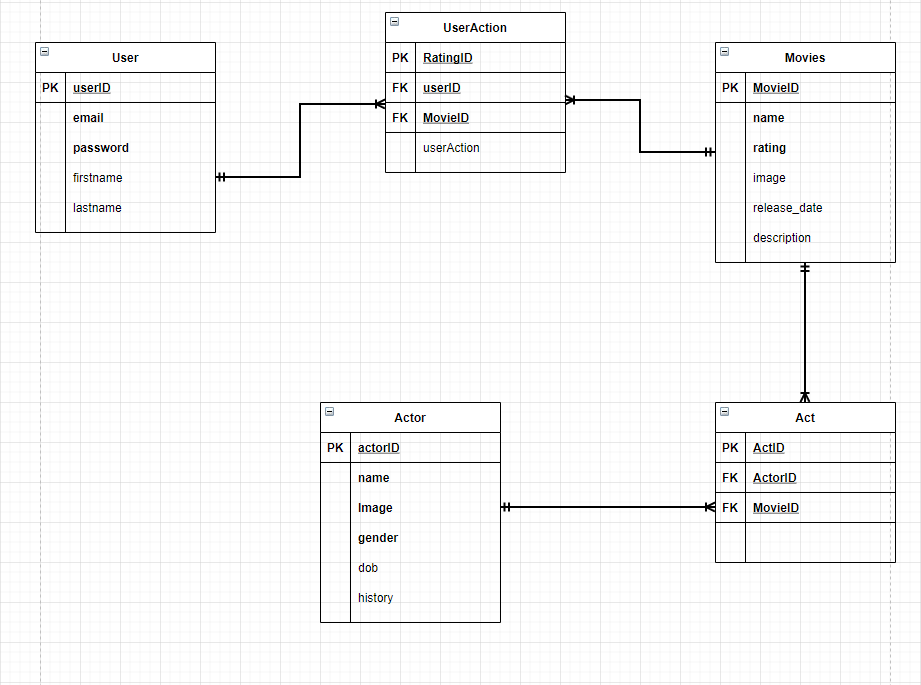

# TEAM'S MEMBERS:
```
Tru Nguyen, Marko Glamocak
```
# TESTING STRATEDGY:
```
We will write tests after each feature we implement, to make sure that it is a functional feature, before moving on to other features. Testing code in smaller chunks is easier 
than testing the entire project at the end. It is easier to spot and fix a bug when your working with a smaller part of a program. Another reason we will be testing each 
feature as soon as we finish implementing it, is so that we can make sure that other features that are built on top of it are easier to debug. If one feature builds off of 
another feature and the first feature has some sort of bug, it just adds to the complexitity of trying to find the bug. The code is larger and more interconnected, making it 
harder to debug. We will also be automating our testing process. The first test we made in this assignment (In Endpoint.test.js) checks to see if a new user can create an 
account successfully and the second test checks to see if this new user can then login successfully after creating an account.
```

## ER Diagram of Database

```
Note: Bold word means that attributes is NOT NULL
```



# SORTING TABLE AND DATA:
```
The sorting table that we implemented in our project allows users to sort movies by "popularity rank", "title", "rating", and "number of people that rated the movie". When 
pressing on a category in the sortable table the movies are first sorted by highest to lowest value, and when the same category is pressed again the movies are sorted from 
lowest to highest values. For some categories, like rank, 1 is a higher value than 10 because 1 is a "higher ranking" on the ranking scale. For other categories 1 is a lower 
value than 10, like for rating, because 10 is a "higher rating" than 1 on the rating scale. A sortable table make it easy for users to find what they are really looking for. 
For example if a user wants to watch a movie that has the most amount of ratings, then they could simply click on the "Number of ratings" table header and the movie with the 
highest number of ratings would show up in the first row of the table. Not only does it make it easier for users to find what they are looking for based on category, but it 
makes it easier for users to compare movies. Comparing items using charts can be limited to 2 (2d chart) or sometimes 3 variables (3d chart). Sortable tables let you compare a 
lot more variables, than just 2 or 3. For example our sortable table has 4 which users can compare and interact with ("popularity rank", "title", "rating", and "number of 
people that rated the movie").
```
